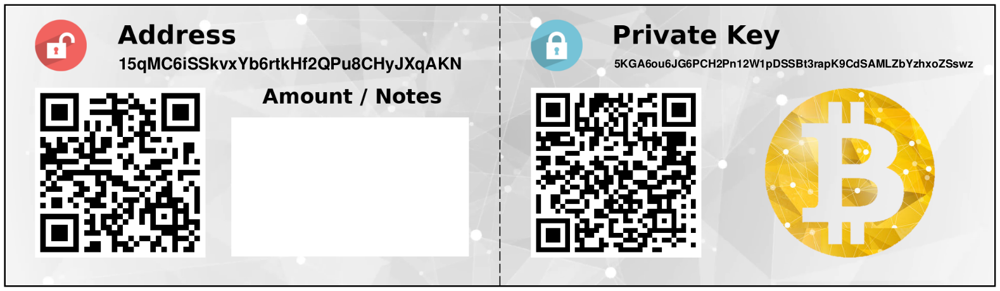

# Elliptic

Elliptic curve library with cryptocurrency wallet utilities.

### Prerequisites/Installation

The <a href="https://www.openssl.org/">OpenSSL</a> library is used for random
number generation and hashing (SHA-256 and RIPEMD-160). Elliptic curve computations
and Base58 conversion requires the <a href="https://gmplib.org/">GMP</a> library
for large integers. The <a href="https://www.boost.org/">Boost</a> library is
used for additional hashing functionality. Finally, LaTeX is required to
generate paper wallet PDFs.

* To install OpenSSL, GMP, Boost, and LaTeX on Debian based systems:

```
sudo apt install libssl-dev libgmp-dev libboost-all-dev texlive-full
```

* For Gentoo Linux, the `xetex` USE flag for `app-text/texlive` must be enabled.
Then install the following packages:

```
sudo emerge --ask dev-libs/openssl dev-libs/gmp dev-libs/boost app-text/texlive
```

* To compile on a machine with the <a href="https://nixos.org/nix/">Nix</a> package
manager, an isolated build environment can be set up with:

```
nix-shell -p openssl gmp boost texlive.combined.scheme-full
```

After installing the above libraries, compile with the included *Makefile*:

```
make
```

### Generating a wallet

Running the generated executable will create a new PDF paper wallet containing
an address and WIF private key. The generated wallet is saved in the LaTeX/
directory.



